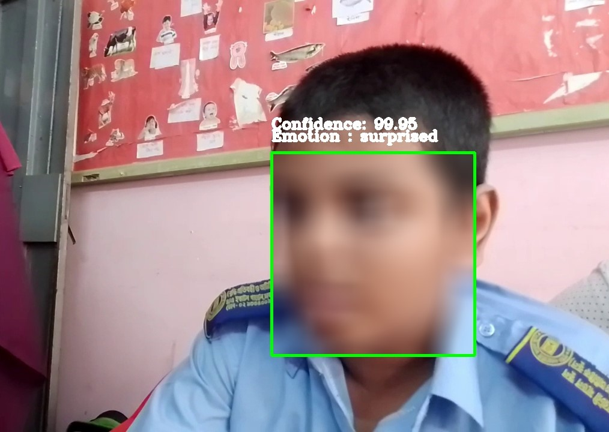

> <b>A novel data driven approach for emotion recognition of children with autism spectrum disorder</b>

This project focuses on creating a real-time emotion recognition system for children with autism. The system processes a continuous stream of images, applies a detection algorithm, and visualizes the results. The primary detection algorithms utilized are ResNet-50, Inception-v2, and InceptionResNet-v2.

## Dataset:
***

 For this project, we gathered the dataset dataset from various specialized schools for autistic children affiliated with the "Society for the Welfare of the Intellectually Disabled (SWID), Bangladesh." With the necessary permissions from the authorities, we created a video dataset by recording interactions with the children and capturing their emotions. Subsequently, we applied preprocessing techniques, including face detection, face alignment, cropping, and resizing of frames, before feeding the data into deep learning algorithms.

## Results

The system is trained using three algorithms: ResNet50, Inception-v3, and InceptionResNet. The performance of these algorithms is evaluated using three metrics: Precision, Recall, and F1 score.

|Model|Metrics|Angry|Fear|Happy|Neutral|Sad|Surprised|
|:----|:----|:----|:----|:----|:----|:----|:----|
|ResNet-50|Pr (%)|70.59|90.91|87.83|97.25|96|88.35|
| |Re (%)|85.71|87.91|96.19|93.81|67.61|88.35|
| |f1|77.42|89.39|91.82|95.5|79.34|88.35|
|Inception-v3|Pr (%)|85.19|96.59|94.39|89.34|94.12|93.07|
| |Re (%)|82.14|93.41|96.19|96.46|90.14|91.26|
| |f1|83.64|94.97|95.28|92.77|92.09|92.16|
|InceptionResnet-v2|Pr (%)|84.09|98.81|94.39|99.98|86.67|91.59|
| |Re (%)|88.1|91.21|96.19|93.81|91.55|95.15|
| |f1|86.05|94.86|95.28|96.8|89.04|93.33|

Model complexity is assessed for each algorithm. To reduce computational load and improve detection frames per second, we implemented a frame skipping technique, where certain frames are skipped during processing.

|Model|Parameters|Train Time (H)|Test Time (mS)   |FPS|  | |
|:----|:----|:----|:----|:----|:----|:-------|
| | | | |skip 0|skip 3|skip 6|
|ResNet-50|23.6M|14.47|92.37|9|17|20|
|Inception-v3|23.9M|15.3|103.65|9|12|15|
|InceptionResNet-v2|55.1M|16.7|106.87|7|10|12|

## Inference

<table>
  <tr>
    <td></td>
    <td></td>
  </tr>
  <tr>
    <td></td>
    <td></td>
  </tr>
  <tr>
  <td>
    
  </td>
  <td>
    
  </td>
  </tr>
</table>

